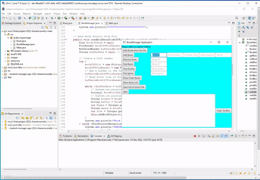

[](https://classroom.github.com/open-in-codespaces?assignment_repo_id=9414771)
# Final Project

**Title:** Book Manager App<br>
**Name:** Shane Munnelly<br>
**Student ID:** G00381223<br>

## Application Function
This application is designed to act as a database of sorts for a series of books and novels utilising javafx and other java processes i have learned throughout the Semester The application is able to complete several functions such as Add book, Remove Book, Check amount of books and more. 
## Running the Application
Provide step by step instructions on how to run your applicaiton. Are there any prerequisite softwares required?

```
List the instructions step by step
    1. Clone this repository to your desktop.
    2. Open it with Eclipse
    3. Compile code in eclipse
    4. Chose whichever options you desire
    5. To add an outside database you must already have a Bin file 
    6. When finished with application click the quit buttom to exit
        
```

## Project Requirments above and beyond

I changed the background colour of the gui to a nice shade of blue aswell as changed the buttons colour, text colour and border colour using the style function<br>
I added an extra varible when making the application <br>
I made it so the search function displayed all the varibles when the searched item is present in the database<br>

## Application Architecture
Discuss in detail how the application is structured. List all Classes. List their method and what they do. Discuss what structures are used to store data objects.
The main classes in this project are<br>
Main.java<br>
Book.java<br>
Bookmanager.java<br>
In Book.java is where i stored my instanced varibles these include BookId,Author,Pages,genre and Size <br>
it also contained the conditions for if an input is valid when entering each of said varibles for example i made it so the author Must only contain Letters.<br> This file is also seralized to allow for the export and import of bin file database<br>
The Methods Present in Book.java Are <br> getbookId and setbookId which are getters and setters <br> getAuthor and setAuthor  which are getters and setters<br> getPages and setPages  which are getters and setters<br> getgenre and setgenre  which are getters and setters<br>  getSize and setSize  which are getters and setters<br>
bookisValid Which is a boolean to check if specific conditions are met to allow for the input to be accepted <br> AuthorIsValid Which is a boolean to check if specific conditions are met to allow for the input to be accepted <br> PagesIsValid Which is a boolean to check if specific conditions are met to allow for the input to be accepted <br> GenreIsValid Which is a boolean to check if specific conditions are met to allow for the input to be accepted <br> SizeIsValid Which is a boolean to check if specific conditions are met to allow for the input to be accepted <br> isValid which is a blanket check for all the previous valid checkers <br> toString Which prints all Varibles declared eariler in this file.
<br> 
<br>
In MI used the style feature to change the colour of buttons and background of the gui<br>ain.java Is where the gui architecture is stored aswell as the interactable components of the gui it calls on the Bookmanager.java and the Book.java to give it varibles and to give its buttons and text boxes function.I used the style feature to change the colour of buttons and background of the gui<br> I used a Pane System to create the gui creating many rows to hold buttons and textboxes. <br>
The methods in this Class are <br> Start which acts as the Stage for the nodes in javafx And <br> main which uses the arguments. 
<br> 
<br>
BookManager.java is where the majourity of my methods are stored IT first implents serialization which allows for the objects to be transfered into bin files This file is also seralized to allow for the export and import of bin file database <br>
The Methods of this class are List which is an to store varibles list <br> Bookmanager which makes the list an array list <br> setBooksList and getBooksList are the getters and setters for the book list <br> addBookToList is the method to allow users to add new information to the database by manually entering A ID,Author,Page number, Genre and Size of the book this is then checked into the conditions for a valid entry set in the Book.java file <br> removeBookFromList this allows users to remove books based on the ID alone as this a unique number to each book <br> findBookByID This allows users to Find all the informaton abot a specific book ID name <br> isOnList This is sused by the Delete function to check if the book id entered is on the list to delete it. <br> findBooksByGenre This allows users to Find all the informaton abot a specific Author <br> printTotalNumberOfBooks This will print the total number of books present in the database<br> printBooksList This will print out every book in the database following a format which was show in the method <br> readBookDataFromCSVFile This method is used to Read the data to a CVS file<br> writeBookDataToCSVFile This method is used to write the data to a CVS file <br> writeBookManagerObjectToFile This allows for objects to be Serialized to the binary file <br> readBookManagerObjectFromFile This allows for objects to be DeSerialized  From the binary file <br>


## JavaFX
When Designing the Gui i went with a non-complex design as i wasent extremely experienced with writing framework for javafx using panes i created a basic window with buttons going down the line with relevant text boxes next to specific ones and at the bottom i used a large output box to show the outputs of the different buttons
I decided that it was a bit boring with just the white default background so i decided to make it a nicer shade of blue which i hope will standout compared to other gui's <br>


## Roadblocks and Unfinished Functionality
When Creating the app i had some issues making the search button function the problem was that i was calling the wrong parameters in the bookmanager I solved this issue by looking over my code with a classmate as we were both having a similar issue. If i was creating the app a second time i would have dedicated more time to creating a nice Gui as i feel the one i have while functional could be spruced up a bit to look more pleasing to the eye perhaps with images and sliders.
## Resources
[W3School.com <br>
](https://www.w3schools.com/java/default.asp) https://www.programcreek.com/java-api-examples/?class=javafx.scene.layout.Pane&method=setStyle
